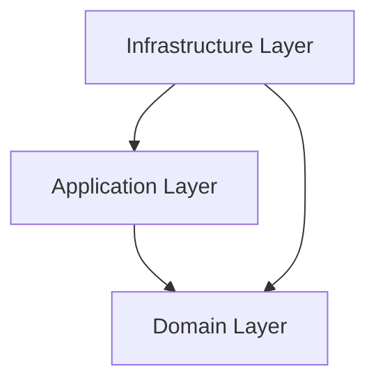

# Project Alpha: Software Architecture Constitution

## Overview
This project follows **Clean Architecture** (also known as Hexagonal Architecture or Ports & Adapters). The main goal is to protect the business logic (Domain) from changes in external factors like frameworks, databases, or UI.

## Architecture Layers

### 1. Domain Layer (The Heart)
- **Path**: `src/domain`
- **Goal**: Represent the business logic and rules.
- **Constraints**: 0 dependencies. No NestJS, no Mongoose, no external libraries.
- **Contents**:
  - `entities/`: Pure business models.
  - `ports/`: Repository and Service interfaces.
  - `exceptions/`: Domain-specific error classes.
- **Critical rule**: If a file in src/domain imports anything from @nestjs/common, the code is invalid.

### 2. Application Layer (Cases of Use)
- **Path**: `src/application`
- **Goal**: Orchestrate the business logic to achieve specific tasks.
- **Constraints**: Only depends on Domain.
- **Contents**:
  - `use-cases/`: Single-purpose classes (e.g., `CreateUserUseCase`).
  - `services/`: Logic that spans multiple use cases.
  - `dtos/`: Input and output data structures.
- **Critical rule**: 
  - If a use case in src/application accesses the database directly without going through a port (interface), the code is invalid.
  - Every new use case must be accompanied by its .spec.ts unit test file.

### 3. Infrastructure Layer (Technical Details)
- **Path**: `src/infrastructure`
- **Goal**: Implement technical details and provide entry points.
- **Constraints**: Can depend on any layer.
- **Contents**:
  - `controllers/`: NestJS Controllers.
  - `persistence/`: Database implementations (Repositories).
  - `adapters/`: External service implementations (e.g., Mailer).
  - `config/`: Environment configuration.

## Dependency Injection
We use NestJS DI system. Implementations from the **Infrastructure** layer are injected into the **Application** layer via the **Ports** defined in the **Domain** layer.

## Source of Truth
The API contract is defined in `docs/openapi.yaml`. Any change to the API must start there.
